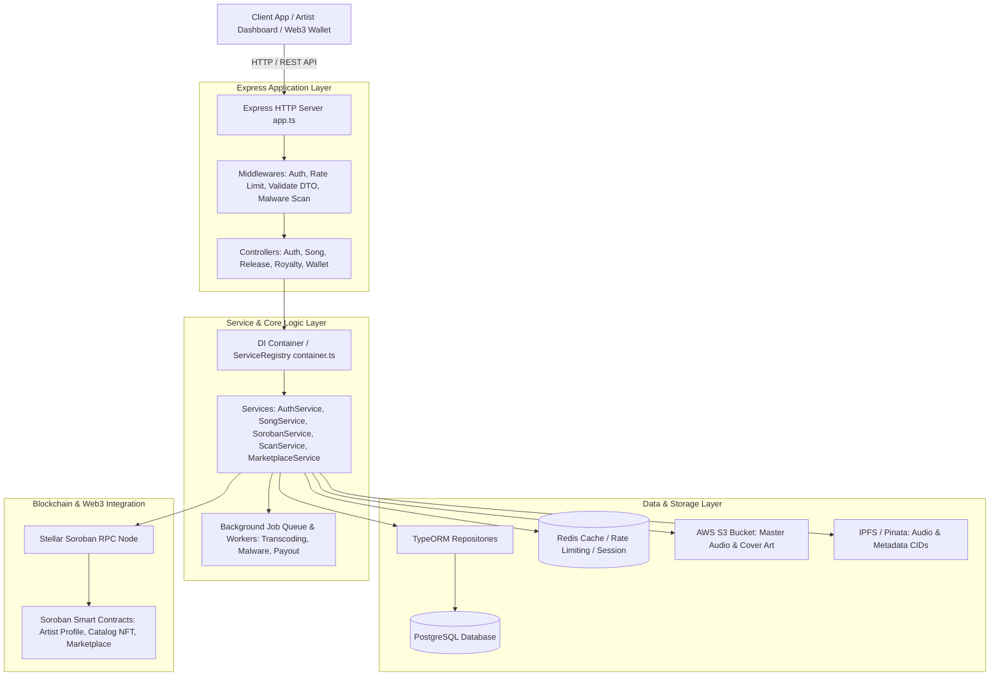
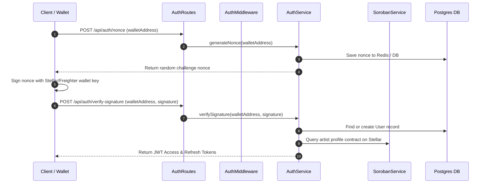
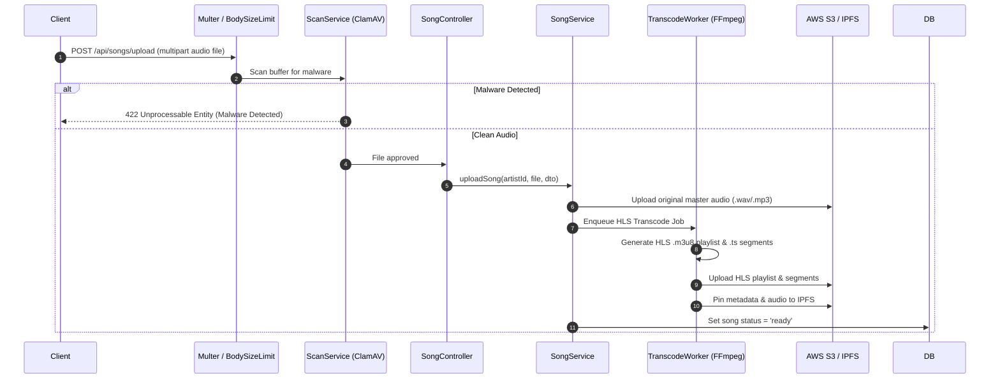
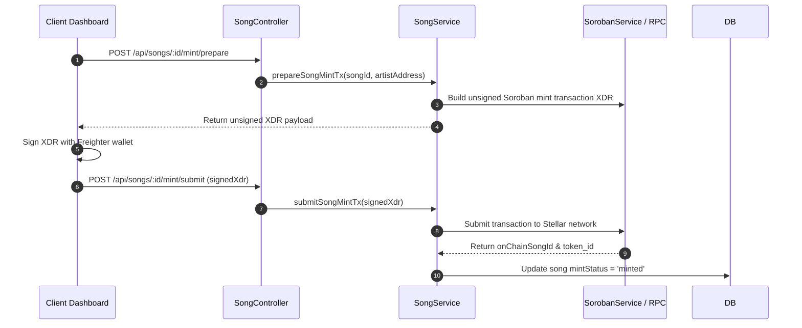

# AudioBlock Backend Architecture Guide

This document provides a high-level architectural overview of the `AudioBlock_Backend` microservices and monolithic API layers, detailing system components, module responsibilities, feature code flows, and links to Architecture Decision Records (ADRs).

---

## High-Level Architecture Diagram

---

## Module Responsibility Guide

The `src/` codebase is organized into distinct domain layers, each with strict responsibilities:

| Module Directory             | Responsibility                                                                                                                                      | Key Files & Artifacts                                                                                                    |
| :--------------------------- | :-------------------------------------------------------------------------------------------------------------------------------------------------- | :----------------------------------------------------------------------------------------------------------------------- |
| `src/app.ts`                 | Express application setup, global middleware registration, security headers, rate limiting, and main router attachment.                             | `app.ts`, `index.ts`                                                                                                     |
| `src/config/`                | Centralized environment variables, database configuration, Redis client initialization, AWS/IPFS options, and constants.                            | `config/db.ts`, `config/redis.ts`, `config/constants.ts`                                                                 |
| `src/controllers/`           | Thin HTTP controllers responsible ONLY for parsing request params/body, invoking services, and returning status codes.                              | `AuthController.ts`, `SongController.ts`, `ReleaseController.ts`, `RoyaltyTemplateController.ts`, `WalletController.ts`  |
| `src/services/`              | Business logic domain layer containing transaction rules, validation, external Web3/S3 integration, and cross-service coordination.                 | `AuthService.ts`, `SongService.ts`, `SorobanService.ts`, `ScanService.ts`, `MarketplaceService.ts`, `ServiceRegistry.ts` |
| `src/entities/`              | TypeORM database entity definitions mapping TypeScript classes to PostgreSQL tables with column decorators and relations.                           | `User.ts`, `Song.ts`, `Album.ts`, `RoyaltyPayout.ts`, `SongCollaborator.ts`, `Release.ts`, `Tag.ts`                      |
| `src/dtos/`                  | Data Transfer Objects defining strict request validation schemas using `class-validator` and `class-transformer`.                                   | `RegisterUserDto.ts`, `LoginDto.ts`, `CreateSongDto.ts`, `UpdateProfileDto.ts`                                           |
| `src/middlewares/`           | Express middlewares for JWT authentication, RBAC authorization, DTO validation, rate limiting, malware scanning, request logging, and sanitization. | `authMiddleware.ts`, `validate.ts`, `authRateLimiter.ts`, `sanitizeInput.ts`, `bodySizeLimit.ts`                         |
| `src/workers/` & `src/jobs/` | Asynchronous job queues and background workers for CPU-intensive audio transcoding (FFmpeg HLS), malware scans, and payout processing.              | `QueueManager.ts`, `Worker.ts`, `JobHandler.ts`                                                                          |
| `src/routes/`                | Express router definitions wiring HTTP paths and HTTP methods to specific middlewares and controller handlers.                                      | `authRoutes.ts`, `songRoutes.ts`, `releaseRoutes.ts`, `royaltyRoutes.ts`                                                 |
| `src/errors/`                | Application-wide error class (`AppError`) handling operational failures, status codes, error codes, and field details.                              | `errors/AppError.ts`                                                                                                     |

---

## Key Feature Code Flows

### 1. Artist Authentication & Web3 Wallet Onboarding Flow

### 2. Song Upload & HLS Transcoding Flow

### 3. Soroban NFT Song Minting Relay Flow

---

## Architecture Decision Records (ADRs)

For in-depth context on key design choices and trade-offs, refer to the decision records in `docs/adrs/`:

- **[ADR 001: Authentication Strategy](file:///Users/sam/Desktop/Drips/AudioBlock_Backend/docs/adrs/001-authentication-strategy.md)** — Dual authentication supporting Stellar wallet signature nonces and email+password with 2FA TOTP.
- **[ADR 002: Blockchain Integration](file:///Users/sam/Desktop/Drips/AudioBlock_Backend/docs/adrs/002-blockchain-integration.md)** — Client-side signing with Soroban backend transaction relay pattern.
- **[ADR 003: File Storage Strategy](file:///Users/sam/Desktop/Drips/AudioBlock_Backend/docs/adrs/003-file-storage-strategy.md)** — AWS S3 for master audio & HLS streaming paired with IPFS/Pinata for immutable metadata CIDs.
- **[ADR 004: Background Job Processing](file:///Users/sam/Desktop/Drips/AudioBlock_Backend/docs/adrs/004-background-job-processing.md)** — Priority job queue and worker pattern for asynchronous transcoding and malware scans.
- **[ADR 005: Database & ORM Selection](file:///Users/sam/Desktop/Drips/AudioBlock_Backend/docs/adrs/005-database-and-orm.md)** — PostgreSQL with TypeORM for relational data integrity, migrations, and strict entity typing.
