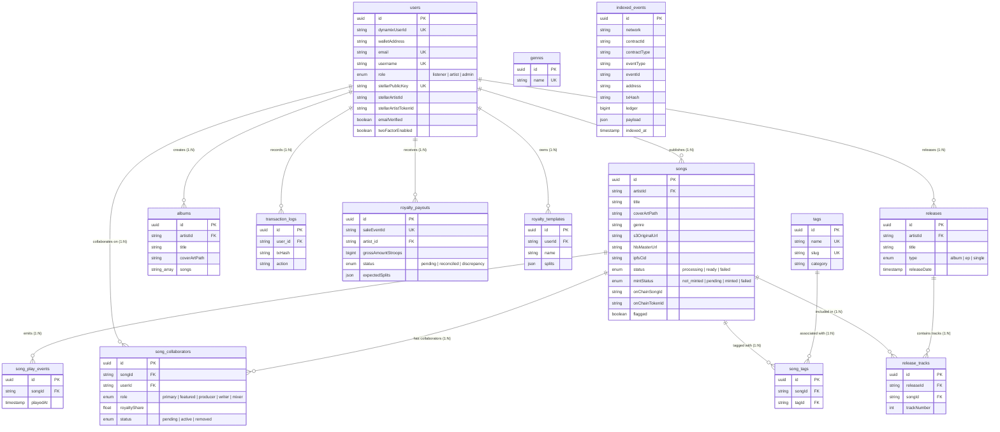

# Database Schema Documentation

This document provides a comprehensive guide to the `AudioBlock_Backend` PostgreSQL database schema, entity relationships, indexes, column descriptions, and migration history.

---

## Entity Relationship Diagram (ERD)

---

## Entity Documentation & Schema Reference

### `users`

Stores user profile information, authentication credentials (wallet address, email/password, 2FA, OAuth), Stellar/Soroban identity pointers, and streaming statistics.

| Column                         | Type          | Constraints                        | Description                                            |
| :----------------------------- | :------------ | :--------------------------------- | :----------------------------------------------------- |
| `id`                           | `uuid`        | `PK`, Default `uuid_generate_v4()` | Unique primary key.                                    |
| `dynamixUserId`                | `varchar`     | `Unique`, `Nullable`               | Dynamic Labs external user ID.                         |
| `profileImage`                 | `varchar`     | `Nullable`                         | S3 URL or path to user avatar.                         |
| `role`                         | `enum`        | Default `'listener'`               | Access role: `'listener'`, `'artist'`, or `'admin'`.   |
| `walletAddress`                | `varchar`     | `Nullable`                         | EVM/Stellar wallet public key used for signature auth. |
| `passwordHash`                 | `varchar`     | `Nullable`                         | Argon2/Bcrypt hash for email+password login.           |
| `twoFactorEnabled`             | `boolean`     | Default `false`                    | Indicates whether 2FA OTP is active.                   |
| `emailVerified`                | `boolean`     | Default `false`                    | Indicates whether email address has been verified.     |
| `twoFactorSecret`              | `varchar`     | `Nullable`                         | Encrypted TOTP secret.                                 |
| `emailVerificationToken`       | `varchar`     | `Nullable`                         | Single-use email verification token.                   |
| `emailVerificationTokenExpiry` | `timestamp`   | `Nullable`                         | Token expiration timestamp.                            |
| `passwordResetToken`           | `varchar`     | `Nullable`                         | Single-use password reset token.                       |
| `passwordResetTokenExpiry`     | `timestamp`   | `Nullable`                         | Password reset expiration timestamp.                   |
| `twoFactorRecoveryCodeHashes`  | `simple-json` | `Nullable`                         | Hashed 2FA recovery backup codes.                      |
| `stellarPublicKey`             | `varchar`     | `Unique`, `Nullable`               | Connected Stellar account public key (`G...`).         |
| `stellarArtistId`              | `varchar`     | `Nullable`                         | Soroban artist contract ID on-chain.                   |
| `stellarArtistTokenId`         | `varchar`     | `Nullable`                         | Token ID of artist profile NFT.                        |
| `username`                     | `varchar`     | `Unique`, `Nullable`               | Unique profile handle.                                 |
| `name`                         | `varchar`     | `Unique`, `Nullable`               | Display name.                                          |
| `email`                        | `varchar`     | `Unique`, `Nullable`               | Email address (validated via `IsEmail`).               |
| `rewardPoints`                 | `float`       | Default `0`                        | Platform loyalty / reward points.                      |
| `totalStreams`                 | `int`         | Default `0`                        | Cumulative song play count across all artist tracks.   |
| `totalStreamTime`              | `int`         | Default `0`                        | Cumulative listening duration in seconds.              |
| `uniqueListeners`              | `int`         | Default `0`                        | Count of distinct listeners.                           |
| `bio`                          | `text`        | `Nullable`                         | Artist biography / profile description.                |
| `pageCover`                    | `varchar`     | `Nullable`                         | Header cover image URL.                                |
| `website`                      | `varchar`     | `Nullable`                         | Personal website URL.                                  |
| `twitterId`                    | `varchar`     | `Nullable`                         | Connected Twitter account ID.                          |
| `twitterUsername`              | `varchar`     | `Nullable`                         | Twitter handle.                                        |
| `twitterDisplayName`           | `varchar`     | `Nullable`                         | Twitter display name.                                  |
| `twitterProfileImage`          | `varchar`     | `Nullable`                         | Twitter avatar image.                                  |
| `twitterVerified`              | `boolean`     | Default `false`                    | Twitter identity verification status.                  |
| `twitterConnected`             | `boolean`     | `Nullable`                         | Twitter OAuth connection status.                       |
| `facebookId`                   | `varchar`     | `Nullable`                         | Connected Facebook account ID.                         |
| `facebookName`                 | `varchar`     | `Nullable`                         | Facebook account name.                                 |
| `facebookEmail`                | `varchar`     | `Nullable`                         | Facebook account email.                                |
| `facebookProfileImage`         | `varchar`     | `Nullable`                         | Facebook avatar image.                                 |
| `facebookConnected`            | `boolean`     | Default `false`                    | Facebook OAuth connection status.                      |
| `createdAt`                    | `timestamp`   | Auto set                           | Account creation timestamp.                            |
| `updatedAt`                    | `timestamp`   | Auto set                           | Last profile update timestamp.                         |

---

### `songs`

Stores track metadata, audio transcode URLs, IPFS CID anchors, Soroban minting state, moderation flags, and royalty split configurations.

| Column           | Type          | Constraints                           | Description                                                         |
| :--------------- | :------------ | :------------------------------------ | :------------------------------------------------------------------ |
| `id`             | `uuid`        | `PK`                                  | Unique track identifier.                                            |
| `artistId`       | `uuid`        | `FK -> users.id`, `ON DELETE CASCADE` | Creator user ID.                                                    |
| `coverArtPath`   | `varchar`     | Required                              | Cover image URL/path.                                               |
| `title`          | `varchar`     | Required                              | Track title.                                                        |
| `description`    | `text`        | `Nullable`                            | Track description / liner notes.                                    |
| `genre`          | `varchar`     | `Nullable`                            | Primary music genre.                                                |
| `artistAddress`  | `varchar`     | `Nullable`                            | Wallet address of publishing artist.                                |
| `s3OriginalUrl`  | `varchar`     | `Nullable`                            | S3 URL to master uncompressed audio file.                           |
| `hlsMasterUrl`   | `varchar`     | `Nullable`                            | S3 URL to HLS `.m3u8` streaming playlist.                           |
| `ipfsCid`        | `varchar`     | `Nullable`                            | IPFS content hash of audio/metadata.                                |
| `duration`       | `float`       | `Nullable`                            | Audio length in seconds.                                            |
| `loudness`       | `float`       | `Nullable`                            | Measured audio loudness (LUFS).                                     |
| `status`         | `varchar`     | Default `'processing'`                | Transcoding status (`processing`, `ready`, `failed`).               |
| `errorReason`    | `text`        | `Nullable`                            | Failure reason if transcoding or malware check fails.               |
| `playCount`      | `int`         | Default `0`                           | Total stream count.                                                 |
| `metadataCid`    | `varchar`     | `Nullable`                            | IPFS metadata CID.                                                  |
| `mintStatus`     | `varchar`     | Default `'not_minted'`                | On-chain mint status (`not_minted`, `pending`, `minted`, `failed`). |
| `onChainSongId`  | `varchar`     | `Nullable`                            | Soroban catalog contract song ID.                                   |
| `onChainTokenId` | `varchar`     | `Nullable`                            | Soroban catalog NFT token ID.                                       |
| `metadata`       | `json`        | `Nullable`                            | Extended audio & track JSON metadata.                               |
| `composers`      | `varchar`     | `Nullable`                            | Composers / songwriters credit string.                              |
| `flagged`        | `boolean`     | Default `false`                       | Moderation flag for copyright/malware review.                       |
| `flaggedAt`      | `timestamp`   | `Nullable`                            | Timestamp when track was flagged.                                   |
| `flaggedBy`      | `varchar`     | `Nullable`                            | Admin/system user who flagged the track.                            |
| `flagReason`     | `text`        | `Nullable`                            | Detailed moderation flag reason.                                    |
| `royaltySplits`  | `simple-json` | `Nullable`                            | Array of template/collaborator royalty split objects.               |
| `createdAt`      | `timestamp`   | Auto set                              | Upload timestamp.                                                   |
| `updatedAt`      | `timestamp`   | Auto set                              | Last track update timestamp.                                        |

---

### `albums`

Represents an album release containing multiple ordered songs.

| Column          | Type           | Constraints                           | Description                         |
| :-------------- | :------------- | :------------------------------------ | :---------------------------------- |
| `id`            | `uuid`         | `PK`                                  | Unique album ID.                    |
| `artistId`      | `uuid`         | `FK -> users.id`, `ON DELETE CASCADE` | Creator artist ID.                  |
| `coverArtPath`  | `varchar`      | Required                              | Album artwork path.                 |
| `title`         | `varchar`      | Required                              | Album title.                        |
| `description`   | `text`         | `Nullable`                            | Album description.                  |
| `genre`         | `varchar`      | `Nullable`                            | Primary album genre.                |
| `songs`         | `simple-array` | Required                              | Array of song UUIDs in track order. |
| `artistAddress` | `varchar`      | `Nullable`                            | Artist wallet address.              |
| `metadataCid`   | `varchar`      | `Nullable`                            | IPFS album metadata CID.            |
| `metadata`      | `json`         | `Nullable`                            | Extended JSON album metadata.       |
| `composers`     | `varchar`      | `Nullable`                            | Composers credit string.            |
| `createdAt`     | `timestamp`    | Auto set                              | Album creation timestamp.           |
| `updatedAt`     | `timestamp`    | Auto set                              | Last album update timestamp.        |

---

### `song_collaborators`

Tracks artist and creator royalty shares and attribution roles for individual tracks.

| Column         | Type        | Constraints                           | Description                                                  |
| :------------- | :---------- | :------------------------------------ | :----------------------------------------------------------- |
| `id`           | `uuid`      | `PK`                                  | Unique collaborator entry ID.                                |
| `songId`       | `uuid`      | `FK -> songs.id`, `ON DELETE CASCADE` | Associated song ID.                                          |
| `userId`       | `uuid`      | `FK -> users.id`, `ON DELETE CASCADE` | Collaborator user ID.                                        |
| `role`         | `varchar`   | Required                              | Role (`primary`, `featured`, `producer`, `writer`, `mixer`). |
| `royaltyShare` | `float`     | Required                              | Percentage share (0.0 to 100.0).                             |
| `status`       | `varchar`   | Default `'active'`                    | Collaboration status (`pending`, `active`, `removed`).       |
| `createdAt`    | `timestamp` | Auto set                              | Record creation timestamp.                                   |
| `updatedAt`    | `timestamp` | Auto set                              | Record update timestamp.                                     |

---

### `song_play_events`

High-volume analytical event table recording every stream play for play-count verification and analytics.

| Column     | Type        | Constraints                           | Description       |
| :--------- | :---------- | :------------------------------------ | :---------------- |
| `id`       | `uuid`      | `PK`                                  | Event UUID.       |
| `songId`   | `uuid`      | `FK -> songs.id`, `ON DELETE CASCADE` | Played song ID.   |
| `playedAt` | `timestamp` | `Index`, Auto set                     | Stream timestamp. |

---

### `royalty_payouts`

Logs on-chain marketplace sales and automated royalty distribution reconciliations.

| Column               | Type          | Constraints                            | Description                                                         |
| :------------------- | :------------ | :------------------------------------- | :------------------------------------------------------------------ |
| `id`                 | `uuid`        | `PK`                                   | Payout record ID.                                                   |
| `saleEventId`        | `varchar`     | `Unique`                               | Soroban contract sale event identifier.                             |
| `saleTxHash`         | `varchar`     | `Nullable`                             | Stellar transaction hash of sale.                                   |
| `onChainEventId`     | `varchar`     | `Nullable`                             | On-chain event sequence identifier.                                 |
| `songId`             | `varchar`     | `Nullable`                             | Associated song ID.                                                 |
| `tokenId`            | `varchar`     | `Nullable`                             | Soroban NFT token ID sold.                                          |
| `buyerPublicKey`     | `varchar`     | `Nullable`                             | Buyer Stellar address.                                              |
| `sellerPublicKey`    | `varchar`     | `Nullable`                             | Seller Stellar address.                                             |
| `currency`           | `varchar`     | Default `'stroops'`                    | Payment currency unit.                                              |
| `grossAmountStroops` | `bigint`      | Required                               | Total sale price in Stroops ($1\text{ XLM} = 10^7\text{ Stroops}$). |
| `expectedSplits`     | `simple-json` | Required                               | Array of calculated payout split objects.                           |
| `status`             | `enum`        | Default `'pending'`                    | Reconciliation state (`pending`, `reconciled`, `discrepancy`).      |
| `discrepancyReason`  | `varchar`     | `Nullable`                             | Explanation if on-chain payout diverges from expectations.          |
| `reconciledAt`       | `timestamp`   | `Nullable`                             | Timestamp when reconciliation completed.                            |
| `artist_id`          | `uuid`        | `FK -> users.id`, `ON DELETE SET NULL` | Recipient artist ID.                                                |
| `createdAt`          | `timestamp`   | Auto set                               | Entry creation timestamp.                                           |
| `updatedAt`          | `timestamp`   | Auto set                               | Entry update timestamp.                                             |

---

### `royalty_templates`

Reusable preset templates for splitting royalties across multiple collaborators.

| Column      | Type          | Constraints                           | Description                                    |
| :---------- | :------------ | :------------------------------------ | :--------------------------------------------- |
| `id`        | `uuid`        | `PK`                                  | Template ID.                                   |
| `name`      | `varchar`     | Required                              | Template title (e.g., "50/50 Producer Split"). |
| `userId`    | `uuid`        | `FK -> users.id`, `ON DELETE CASCADE` | Template owner user ID.                        |
| `splits`    | `simple-json` | Required                              | JSON array of `{ userId, role, percentage }`.  |
| `createdAt` | `timestamp`   | Auto set                              | Creation timestamp.                            |
| `updatedAt` | `timestamp`   | Auto set                              | Update timestamp.                              |

---

### `tags` & `song_tags`

Categorization taxonomy for discovery and filtering.

#### `tags`

| Column      | Type        | Constraints    | Description                                          |
| :---------- | :---------- | :------------- | :--------------------------------------------------- |
| `id`        | `uuid`      | `PK`           | Tag ID.                                              |
| `name`      | `varchar`   | `Unique Index` | Display tag name.                                    |
| `slug`      | `varchar`   | `Unique Index` | URL-safe slug.                                       |
| `category`  | `varchar`   | `Nullable`     | Optional taxonomy category (e.g., Mood, Instrument). |
| `createdAt` | `timestamp` | Auto set       | Tag creation timestamp.                              |

#### `song_tags`

| Column   | Type   | Constraints                           | Description     |
| :------- | :----- | :------------------------------------ | :-------------- |
| `id`     | `uuid` | `PK`                                  | Association ID. |
| `songId` | `uuid` | `FK -> songs.id`, `ON DELETE CASCADE` | Tagged song ID. |
| `tagId`  | `uuid` | `FK -> tags.id`, `ON DELETE CASCADE`  | Applied tag ID. |

---

### `releases` & `release_tracks`

Discography releases (Albums, EPs, Singles) and track listings.

#### `releases`

| Column        | Type        | Constraints                           | Description                             |
| :------------ | :---------- | :------------------------------------ | :-------------------------------------- |
| `id`          | `uuid`      | `PK`                                  | Release ID.                             |
| `title`       | `varchar`   | Required                              | Title of the release.                   |
| `artistId`    | `uuid`      | `FK -> users.id`, `ON DELETE CASCADE` | Artist user ID.                         |
| `releaseDate` | `timestamp` | Required                              | Scheduled/actual release date.          |
| `type`        | `varchar`   | Default `'album'`                     | Release type (`album`, `ep`, `single`). |
| `coverArt`    | `varchar`   | `Nullable`                            | Artwork image path.                     |
| `createdAt`   | `timestamp` | Auto set                              | Record creation timestamp.              |
| `updatedAt`   | `timestamp` | Auto set                              | Record update timestamp.                |

#### `release_tracks`

| Column        | Type   | Constraints                              | Description                                   |
| :------------ | :----- | :--------------------------------------- | :-------------------------------------------- |
| `id`          | `uuid` | `PK`                                     | Track listing ID.                             |
| `releaseId`   | `uuid` | `FK -> releases.id`, `ON DELETE CASCADE` | Parent release ID.                            |
| `songId`      | `uuid` | `FK -> songs.id`, `ON DELETE CASCADE`    | Included song ID.                             |
| `trackNumber` | `int`  | Required                                 | Sequence position on release (1-based index). |

---

### `transaction_logs`

Audit log of blockchain and system transactions executed by platform users.

| Column        | Type        | Constraints                           | Description                                       |
| :------------ | :---------- | :------------------------------------ | :------------------------------------------------ |
| `id`          | `uuid`      | `PK`                                  | Transaction log entry ID.                         |
| `user_id`     | `uuid`      | `FK -> users.id`, `ON DELETE CASCADE` | Initiating user ID.                               |
| `txHash`      | `varchar`   | Required                              | On-chain transaction hash or internal reference.  |
| `action`      | `varchar`   | Required                              | Performed action identifier (e.g. `'MINT_SONG'`). |
| `description` | `text`      | `Nullable`                            | Human-readable log details.                       |
| `createdAt`   | `timestamp` | Auto set                              | Log timestamp.                                    |
| `updatedAt`   | `timestamp` | Auto set                              | Update timestamp.                                 |

---

### `genres`

System music genre lookup table.

| Column      | Type        | Constraints | Description                      |
| :---------- | :---------- | :---------- | :------------------------------- |
| `id`        | `uuid`      | `PK`        | Genre ID.                        |
| `name`      | `varchar`   | `Unique`    | Genre name (e.g. `"Afrobeats"`). |
| `createdAt` | `timestamp` | Auto set    | Record creation timestamp.       |
| `updatedAt` | `timestamp` | Auto set    | Record update timestamp.         |

---

### `indexed_events`

Durable persistence for on-chain events indexed from Stellar / Soroban contracts.

| Column         | Type        | Constraints                 | Description                                                                               |
| :------------- | :---------- | :-------------------------- | :---------------------------------------------------------------------------------------- |
| `id`           | `uuid`      | `PK`                        | Unique event record identifier.                                                           |
| `network`      | `varchar`   | Default `'stellar-testnet'` | Blockchain network identifier.                                                            |
| `contractId`   | `varchar`   | `Nullable`                  | Soroban smart contract ID.                                                                |
| `contractType` | `varchar`   | `Nullable`                  | Contract classification (`'nft'`, `'artist'`, `'catalog'`, `'royalty'`, `'marketplace'`). |
| `eventType`    | `varchar`   | Required                    | Event identifier/topic (`'mint'`, `'transfer'`, `'sale'`, `'royalty_payout'`).            |
| `eventId`      | `varchar`   | `Nullable`                  | Ledger-unique event identifier.                                                           |
| `address`      | `varchar`   | `Nullable`                  | Associated Stellar account or contract address.                                           |
| `txHash`       | `varchar`   | `Nullable`                  | Stellar transaction hash.                                                                 |
| `ledger`       | `bigint`    | `Nullable`                  | Ledger sequence number where event occurred.                                              |
| `payload`      | `jsonb`     | `Nullable`                  | Decoded on-chain event payload metadata.                                                  |
| `data`         | `jsonb`     | `Nullable`                  | Event details JSON.                                                                       |
| `indexed_at`   | `timestamp` | Auto set                    | Timestamp when event was indexed by backend.                                              |
| `createdAt`    | `timestamp` | Auto set                    | Record creation timestamp.                                                                |
| `updatedAt`    | `timestamp` | Auto set                    | Record update timestamp.                                                                  |

---

## Database Indexes & Optimization

| Table                | Index Columns                            | Type     | Purpose                                                               |
| :------------------- | :--------------------------------------- | :------- | :-------------------------------------------------------------------- |
| `users`              | `(walletAddress, email, username)`       | `UNIQUE` | Multi-column unique constraint preventing profile collisions.         |
| `users`              | `stellarPublicKey`                       | `UNIQUE` | Enforces 1-to-1 mapping between Stellar address and platform account. |
| `songs`              | `artistId`                               | `INDEX`  | Accelerates fetching songs by artist.                                 |
| `song_collaborators` | `(songId, userId)`                       | `UNIQUE` | Prevents duplicate collaborator entries for the same song.            |
| `song_play_events`   | `songId`                                 | `INDEX`  | Fast aggregation of play events for specific songs.                   |
| `song_play_events`   | `playedAt`                               | `INDEX`  | Efficient time-series filtering for analytics dashboards.             |
| `royalty_payouts`    | `saleEventId`                            | `UNIQUE` | Ensures idempotent processing of on-chain sale events.                |
| `tags`               | `name`, `slug`                           | `UNIQUE` | Prevents duplicate tags and optimizes tag lookup by slug.             |
| `song_tags`          | `(songId, tagId)`                        | `UNIQUE` | Prevents duplicate tag associations.                                  |
| `release_tracks`     | `(releaseId, songId)`                    | `UNIQUE` | Guarantees uniqueness of songs per release.                           |
| `indexed_events`     | `(network, contractId, ledger, eventId)` | `UNIQUE` | Enforces idempotency preventing duplicate event ingestion.            |
| `indexed_events`     | `(network, contractId, ledger)`          | `INDEX`  | Fast event querying by contract and ledger range.                     |
| `indexed_events`     | `txHash`                                 | `INDEX`  | Fast reconciliation and lookup by Stellar transaction hash.           |

---

## Migration History Summary

Database migrations located in `src/migrations/` execute sequentially to maintain schema state:

1. **`1719619200000-CreateInitialSchema.ts`**: Baseline schema initializing `users`, `songs`, `albums`, `genres`, and `transactions_logs` tables with initial FKs.
2. **`1719619200000-AddPlayCountToSong.ts`**: Adds default `playCount` integer column to `songs`.
3. **`1719619200001-AddEmailVerificationAndPasswordResetToUser.ts`**: Extends `users` with `emailVerified`, `emailVerificationToken`, `emailVerificationTokenExpiry`, `passwordResetToken`, and `passwordResetTokenExpiry`.
4. **`1719619300000-AddPlayCountToSong.ts`**: Idempotent play count migration guard.
5. **`1751236800000-AddSongModeration.ts`**: Adds moderation flag fields (`flagged`, `flaggedAt`, `flaggedBy`, `flagReason`) to `songs`.
6. **`1751500000000-AddRoyaltyTemplate.ts`**: Creates `royalty_templates` table for collaborator split presets.
7. **`1751500000001-AddSongRoyaltySplits.ts`**: Adds `royaltySplits` JSON column to `songs`.
8. **`1753000000000-AddSongPlayEvent.ts`**: Creates `song_play_events` analytical table with index on `playedAt`.
9. **`1753000000001-AddSongCollaborator.ts`**: Creates `song_collaborators` table for track-level royalty shares.
10. **`1753000000002-AddTags.ts`**: Creates `tags` and `song_tags` taxonomy tables.
11. **`1753000000003-AddReleases.ts`**: Creates `releases` and `release_tracks` discography tables.
12. **`1754600000000-AddIndexedEvents.ts`**: Creates `indexed_events` table with unique deduplication and query indexes.

---

## Schema Maintenance & Updates

When making changes to database models:

1. Modify or create TypeORM entity files in `src/entities/`.
2. Generate a new timestamped migration script in `src/migrations/` using TypeORM CLI (`npm run migration:generate`).
3. Update this documentation file (`docs/database-schema.md`) to reflect newly added tables, columns, indexes, or cardinality changes.
